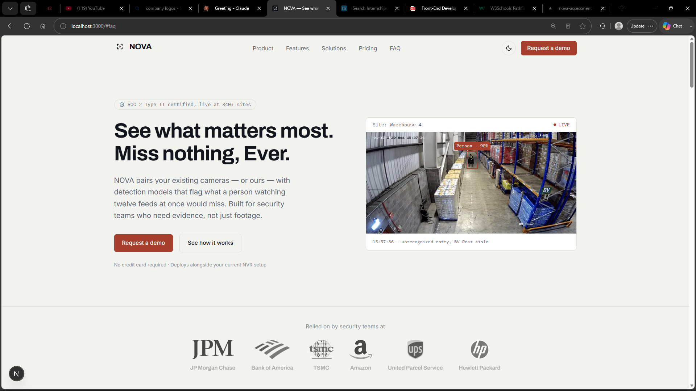
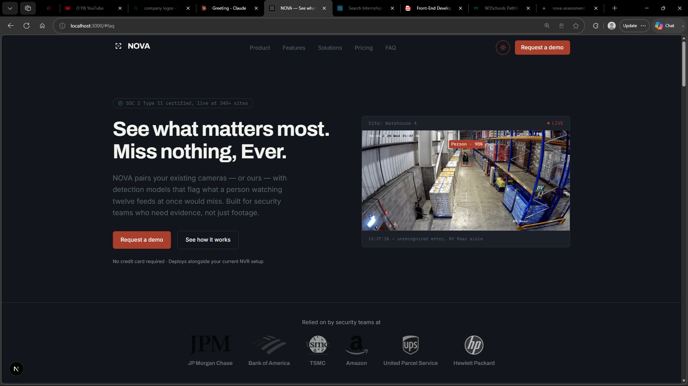
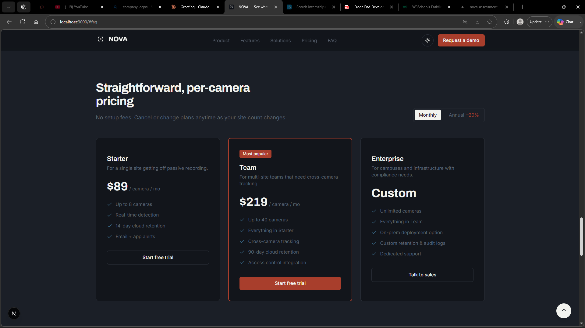
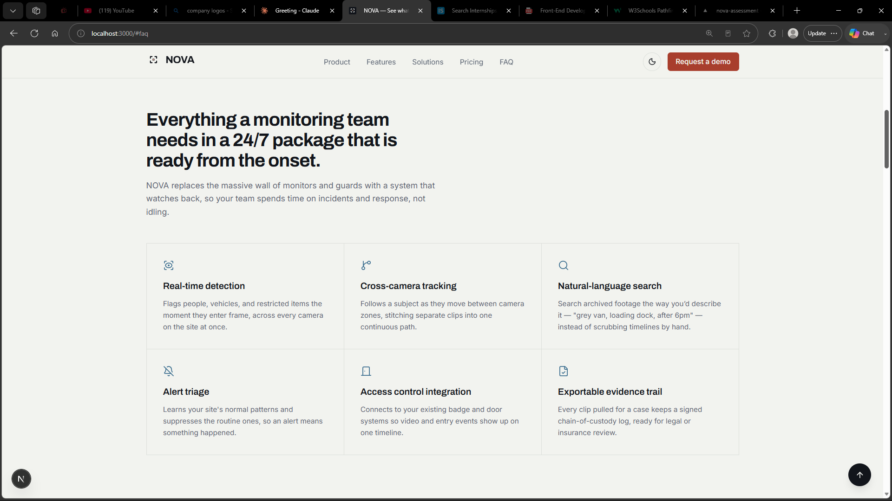

# NOVA — AI surveillance platform (landing page)

This is the landing page for **NOVA**, a fake AI surveillance
company that offers cameras and detection software to customers, built as a
front-end development internship assignment for Sankar Group.

## Technologies used

- **Next.js** (App Router) — React framework, chosen because it was the
  preferred stack for the assignment and gives built-in font optimization,
  routing, and a fast dev/build pipeline out of the box
- **React 19**
- **Tailwind CSS** — utility-first styling, using the new CSS-based
  `@theme` token system instead of a JS config file
- **Next-themes** — light/dark mode with system-preference detection and no
  flash-of-wrong-theme on load
- **Lucide-react** — icon set
- **TypeScript** for app-level files (`layout.tsx`, `page.tsx`); component
  internals are plain JS/JSX (`allowJs` enabled) since the components don't
  need static typing to stay readable at this project's size

## Features

- Responsive nav with a mobile hamburger menu (body-scroll-locked while open)
- Smooth-scrolling in-page navigation to every section
- Hero with a mocked live-camera-feed panel focused on a stranger.
- 6-feature grid, product/pipeline breakdown, 4-step "how it works" sequence
- Animated statistics that count up once scrolled into view
- Scroll-reveal on section entry
- Use-case/solutions grid, 3 testimonials, 3-tier pricing with a working
  monthly/annual toggle, 6-question FAQ accordion
- Back-to-top button via `IntersectionObserver`
- Full light/dark mode, toggle in the nav, respects OS preference on first
  visit and persists the user's choice
- Semantic HTML, `aria-expanded`/`aria-controls` on the accordion and mobile
  menu, visible focus rings, `prefers-reduced-motion` respected throughout


## Component structure

```
app/
  layout.tsx        # fonts, theme provider, metadata
  page.tsx           # assembles all sections in order
  globals.css         # design tokens (@theme), dark-mode variant
  components/
    layout/            # Navbar, Footer
    sections/           # one component per required page section
    ui/                 # Logo, ThemeToggle, BackToTop, Reveal (shared)
  hooks/
    useInView.js         # IntersectionObserver wrapper (reveals + stat trigger)
    useCountUp.js        # requestAnimationFrame count-up animation
  public/
    images/            # images and svgs
    fonts/             # local fonts
```

Each of the assignment's 13 required sections is its own component under
`components/sections/`, imported once into `app/page.tsx` — nothing is
defined inline in the page file, so any section can be reordered, reused, or
tested in isolation.

## Challenges

- Tailwind v4's `@theme`-based token system (no `tailwind.config.js`) meant
  wiring dark mode through a custom `@custom-variant dark` directive rather
  than the old `darkMode: 'class'` config option.
- Balancing the "technical/surveillance" visual language against explicit
  guidance to avoid generic AI-site patterns (all-caps eyebrow labels,
  em-dash-joined meta strings) — some of the camera-overlay-style copy
  legitimately mirrors real CCTV timestamp formats, but a few first-draft
  labels were decorative rather than functional and were rewritten in plain
  sentence case.
- Designing the hooks was a mental challenge that was difficult to understand.

## AI tools used

Claude was used in the development of this project to aid in code refinements, adjustments and suggestions of certain modules.

## Installation

```bash
npm install
npm run dev     # http://localhost:3000
```

```bash
npm run build   # production build
npm run start   # serve the production build
```

## Deploying

The repository is hosted [here](https://nova-assessment-blush.vercel.app/) on vercel.

## Screenshots

- Landing page (light)


- Landing page (dark)


- Pricing (dark) 


- Features (light)
